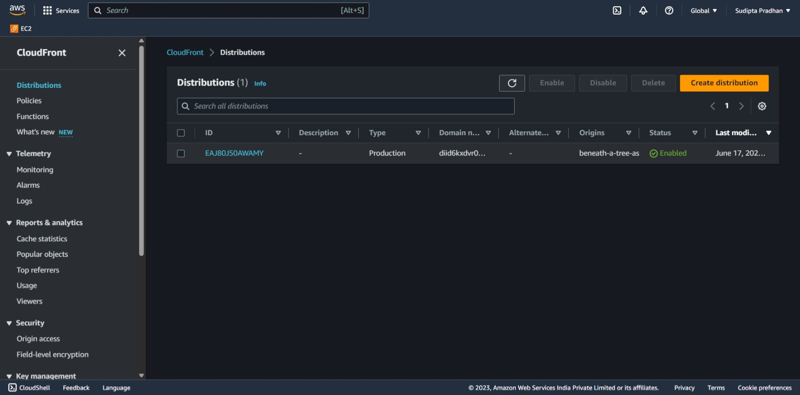

# BeneathAtree interview screening challenge

## Description

This is a express app that uses AWS S3 and CloudFront to generate a signed URL to access a private file. The generated URL is valid for 5 minutes.

## Instructions to run locally

1. Clone the repo

    ```bash
    git clone https://github.com/sudipta9/beneath-a-tree-assignment.git
    ```

2. Install dependencies

    ```bash
    npm install
    ```

3. Create a `.env` file in the root directory and add the following environment variables **(for demo purposes, I have added my own credentials inside the source code)**

    ```bash
    AWS_CLOUDFRONT_PRIVATE_KEY_PATH=<path to saved pem file>
    AWS_BUCKET_NAME=<bucket name>
    AWS_REGION=<region>
    AWS_ACCESS_KEY=<AWS IAM user access key>
    AWS_SECRET_ACCESS_KEY=<AWS IAM user secret access key>
    AWS_CLOUDFRONT_KEY_PAIR_ID=<CloudFront key pair id>
    ```

4. Run the app

    ```bash
    npm start
    ```

5. Open the browser and go to `http://localhost:3000/` the url will automatically redirect to the signed url. **(You can also copy the signed url from console and open it in a new tab)**

___
___

## Screenshots

### S3 bucket Permissions Page


### S3 bucket Policy Page


### S3 bucket access point page


### S3 Bucket object page


### CloudFront Distribution General page



### CloudFront Distributions Origin Access Identity page


